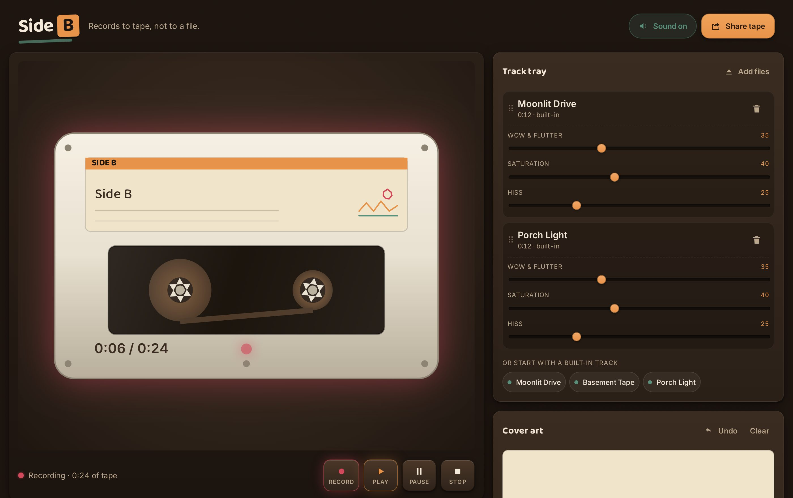

# Side B

**▶ Live demo — [apps.charliekrug.com/side-b](https://apps.charliekrug.com/side-b/)**

Turn a playlist into a tape you can hear.

[](https://github.com/ctkrug/side-b/actions/workflows/ci.yml)
[](LICENSE)

Side B is a cassette tape maker that runs in your browser. Pick a few songs, press
record, and you hear them the way a tape would have played them: a hiss floor under the
quiet parts, the pitch wobbling as a worn motor drags, and the transients rounded off by
saturation. The reels turn in time with the audio. When it sounds right, one link carries
the whole tape to whoever you made it for.



## Who it's for

People who still make a playlist for one specific person and want to send something that
feels made rather than listed. Every other mixtape tool on the web is a cover-art
generator: pick a template, type a title, export a JPEG to post next to a streaming link.
The audio is never touched. Side B works the other way round. The sound is the point.

## Why it sounds like tape and not like a filter

The chain is built from scratch in the Web Audio API, and every part of it is live:

- **Wow and flutter.** Two LFOs drive a variable delay line, bending pitch slowly and
  quickly at once, the way an unstable transport does.
- **Saturation.** A waveshaper curve compresses peaks and adds harmonics, so loud
  transients round off instead of clipping.
- **Hiss.** Filtered noise sits under the music, level matched so it reads as a noise
  floor rather than static.
- **Reels driven by the audio clock.** Rotation and the take-up ratio come from
  `AudioContext` playback position, so the picture cannot drift from the sound.

Drag a slider and the graph retunes under the playhead. There is no rendered file to wait
for, and no plugin, server, or pre-baked audio anywhere in it.

## Using it

1. **Load the tray.** Click a built-in track, or drop your own audio files on it. Files
   are decoded in your browser and never uploaded.
2. **Press record.** The reels spin, the counter runs, and the full chain is already on.
   No setup.
3. **Turn the knobs.** Wow and flutter, saturation and hiss, per track.
4. **Doodle a cover.** It prints onto the cassette's j-card label.
5. **Press Share tape.** The link lands on your clipboard.

The share link carries the tracklist, every effect setting and your drawing, encoded in
the URL itself. There is no backend and no account. Built-in tracks are synthesized in
code, which is what lets a link rebuild the same tape on someone else's machine; a tape
holding your own files asks whoever opens it to supply that audio.

## Development

```bash
npm install
npm run dev      # local dev server
npm test         # unit tests
npm run coverage # unit tests + a coverage report
npm run lint     # eslint
npm run build    # static production build into site/
```

448 tests cover the DSP, the mixtape model, the share-link codec and the renderer, at
99.7% of lines. The build is base-path relative, so the output can be served from any
subpath.

## Stack

- Vanilla JavaScript, ES modules, no framework
- Web Audio API for all DSP, with no pre-baked audio files
- Canvas 2D for the cassette and the doodle pad
- [Vite](https://vitejs.dev/) for the dev server and the static build
- [Vitest](https://vitest.dev/) and [fast-check](https://fast-check.dev/) for tests

## Docs

- [`docs/VISION.md`](docs/VISION.md) for what it is and why
- [`docs/DESIGN.md`](docs/DESIGN.md) for the visual direction and tokens
- [`docs/ARCHITECTURE.md`](docs/ARCHITECTURE.md) for the code map and signal graph
- [`docs/launch/devto.md`](docs/launch/devto.md) for a writeup of two build problems

## License

MIT, see [LICENSE](LICENSE).

More of Charlie's projects → https://apps.charliekrug.com
